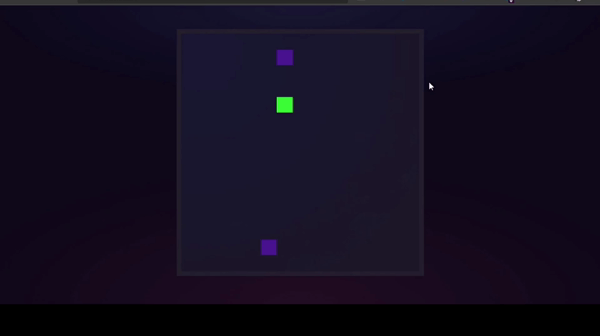

 ##  Modelo de Jogo multiplayer 2d

<h1 align="center">
    
</h1>
 
 ### *Jogo multiplayer 2d* básico feito com base em aulas da Rocketseat e aulas de Filipe Deschamps.
 ### Integrando socket.io em implementação javascript, além de técnica para utilização web.
 #### Feito por *Matheus Santos Lima* 

